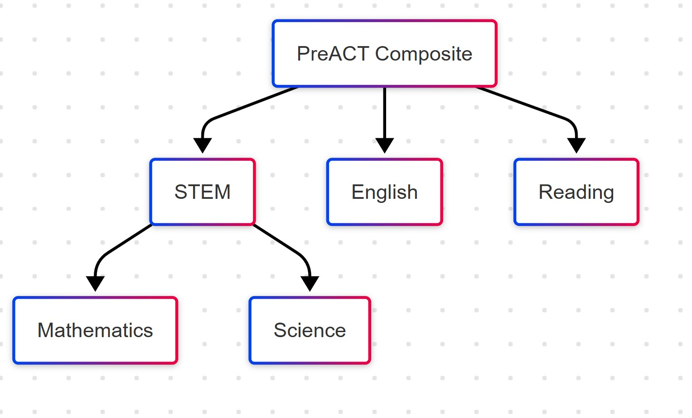
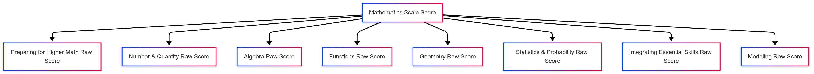
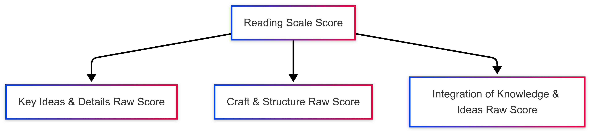
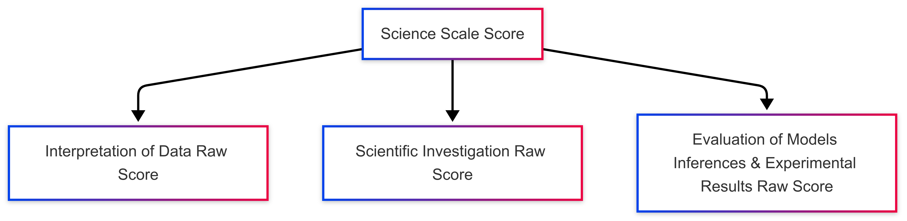
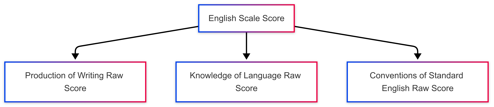
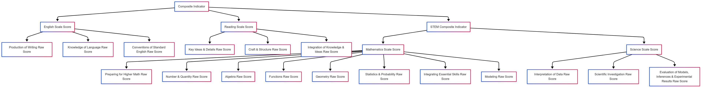
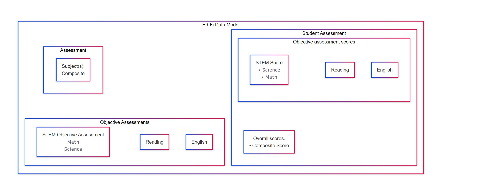

# Assessment Details

## Assessment Identifier(s)
- PreACT (the name of the assessment)

## Assessment Family
- PreACT

## Assessment Score Method Descriptors
- uri://act.org/AssessmentReportingMethodDescriptor#Scale Score
- uri://act.org/AssessmentReportingMethodDescriptor#Raw Score
- uri://act.org/AssessmentReportingMethodDescriptor#National Norms Score
- uri://act.org/AssessmentReportingMethodDescriptor#High Scale Score
- uri://act.org/AssessmentReportingMethodDescriptor#Low Scale Score
- uri://act.org/AssessmentReportingMethodDescriptor#Predicted High Scale Score
- uri://act.org/AssessmentReportingMethodDescriptor#Predicted Low Scale Score
- uri://act.org/AssessmentReportingMethodDescriptor#Progress Toward Career Readiness Indicator
  
# Hierarchy
Here is the Overall Hierarchy

The expansion of the hierarchy of the each Objective 
## Math

## Reading

## Science

## English

Here is a Visualization of the entire hierarchy 

## StudentAssessmentEducationOrganizationAssociation
-School_Reported_Code is mapped for this entity. I am not really sure if that is the right field , there doesn't seem to be district code anywhere in the file. 

## Reasoning
The PreACT Composite assessment has objectives such as:
- Mathematics
  - Preparing for Higher Math
  - Number & Quantity
  - Algebra
  - Functions
  - Geometry
  - Statistics & Probability
  - Integrating Essential Skills
  - Modeling 
- English 
  - Production of Writing
  - Knowledge of Language
  - Conventions of Standard English
- Science 
  - Interpretation of Data
  - Scientific Investigation
  - Evaluation of Models, Inferences & Experimental Results
- Reading
  - Key Ideas & Details
  - Craft & Structure
  - Integration of Knowledge & Ideas
The PreACT-STEM has the following objectives: 
- Mathematics
  - Preparing for Higher Math
  - Number & Quantity
  - Algebra
  - Functions
  - Geometry
  - Statistics & Probability
  - Integrating Essential Skills
  - Modeling 
- Science 
  - Interpretation of Data
  - Scientific Investigation
  - Evaluation of Models, Inferences & Experimental Results

EdFi Model 

The further breakdown of the subjects is also captured using Objective Assessments using the parent Objective Relation shown in the hierarchy. 
